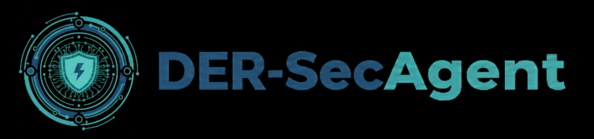

<p align="center">
  
</p>


# DER-SecAgent

> **DER-SecAgent: A Multi-Agent based Cybersecurity Framework for Distributed Energy Resources**  
> AI agent to assist with cybersecurity for DER and power-system OT/ICS.

**DER-SecAgent** uses domain-adapted language models to help with:

- Security assessments for solar PV, ESS, inverters/PCS, EV chargers, EMS/DERMS, etc.
- Threat and risk analysis for OT/ICS architectures
- Drafting security reports, checklists, and action plans

This repository is intended as a **research / prototype framework**, not a production-ready security product.

---

## Key Features

This module implements the **DER-SecAgent multi-agent layer** orchestrated by an Automation Tool:

- **Two operating modes**
  - **`Script_Gen`**: Generate executable mitigation scripts (iptables-only in experiments)
  - **`Report_Gen`**: Generate structured incident reports for operators
- **Safety gate**
  - **Caution Agent** reviews proposed scripts for potentially irreversible / high-impact actions
  - Supports **human approval via ChatOps** (e.g., Slack) before execution
- **(Optional) Evaluation role for experiments**
  - A Judge-style evaluation agent can score scripts on **Syntax / Security / Optimization** (Agent-as-a-Judge)

This repository is a **research prototype** and is **not** a production-ready security product.

---

## Architecture Overview

### Agents (roles)
- **Script Agent**
  - Input: normalized IDS-style alert fields (attack type, src/dst IP/port, protocol, etc.)
  - Output: candidate mitigation script (iptables rules in our experiments)
- **Caution Agent (Safety / Irreversibility Gate)**
  - Checks if the generated CLI script may cause irreversible changes
  - Emits a boolean *caution* flag + short rationale for operator/automation gating
- **Report Agent**
  - Produces a structured incident report (overview, assets, actions, impact, recommendations)
  - Includes a conditional re-check path when a script is modified (**`is_script_changed`**)
- **(Optional) Judge Agent (Experiment/Evaluation)**
  - Scores generated scripts on Syntax/Security/Optimization using an LLM-as-a-Judge protocol

### Workflow (LangGraph)
- Implemented as a **LangGraph state machine**
- Automation Tool chooses **Mode**:
  - `Script_Gen` → Script Agent → Caution Agent → return script (for ChatOps approval)
  - `Report_Gen` → (optional Caution re-check if `is_script_changed=True`) → Report Agent

---

## Model used by agents (DER-SecAgent backbone)

All agent roles can share a **single domain-adapted LLaMA-family backbone** (role specialization via prompts/tool schemas).
We provide a published LoRA adapter on Hugging Face:

- **DER-SecAgent LoRA adapter**: `MyeongHaHwang/DER-SecAgent-LLama3.2-3B-Inst-SFT`  
  (Base: `meta-llama/Llama-3.2-3B-Instruct`, PEFT/LoRA style loading)

---

## Getting Started

### 1) Install
```bash
pip install -U "transformers>=4.43" peft accelerate
pip install -U langgraph langchain-core
# optional (quantization)
pip install -U bitsandbytes
```

###2) Load the DER-SecAgent adapter (example)

```bash
from transformers import AutoModelForCausalLM, AutoTokenizer
from peft import PeftModel

base_id = "meta-llama/Llama-3.2-3B-Instruct"
lora_id = "MyeongHaHwang/DER-SecAgent-LLama3.2-3B-Inst-SFT"

tok = AutoTokenizer.from_pretrained(base_id)
base = AutoModelForCausalLM.from_pretrained(base_id, device_map="auto")
model = PeftModel.from_pretrained(base, lora_id)
```
###


## Cite Us

If you use this repository or the DER-SecAgent LoRA adapter in your research or projects, please cite:

```bibtex
@misc{hwang2025dersecagent_repo,
  title        = {DER-SecAgent: A Multi-Agent based Cybersecurity Framework for Distributed Energy Resources (Code)},
  author       = {Myeong-Ha Hwang and Kyungmin Kim and Hyeongu Kim and Yoojin Kwon and Sungho Lee},
  year         = {2025},
  howpublished = {\url{https://github.com/KEPSOAR/DER-SecAgent}},
  note         = {Multi-agent workflow (LangGraph) + ChatOps-oriented response pipeline}
}

@misc{hwang2025dersecagent_lora,
  title        = {DER-SecAgent-LLama3.2-3B-Inst-SFT (LoRA adapter)},
  author       = {Myeong-Ha Hwang and Kyungmin Kim and Hyeongu Kim and Yoojin Kwon and Sungho Lee},
  year         = {2025},
  howpublished = {\url{https://huggingface.co/MyeongHaHwang/DER-SecAgent-LLama3.2-3B-Inst-SFT}},
  note         = {PEFT/LoRA adapter for DER/OT/ICS cybersecurity assistance}
}

